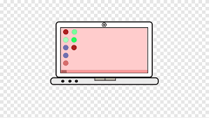

# Proyecto_formulario
<a name="readme-top"></a>

<div align="center">


<br/>
<h3><b>DOCUMENTACION PROYECTO</b>

</div>

# ✅ TABLE OF CONTENTS
- [Proyecto\_formulario](#proyecto_formulario)
- [✅ TABLE OF CONTENTS](#-table-of-contents)
- [📖 \[NETWORK SCRIPT PROJECT\]](#-network-script-project)
  - [⚒ Build With ](#-build-with-)
    - [Tech Stack ](#tech-stack-)
    - [Key Features ](#key-features-)
  - [💻 Getting Started ](#-getting-started-)
    - [Prerequsites](#prerequsites)
    - [Setup](#setup)
    - [Install](#install)
    - [Usage](#usage)
    - [Run Test](#run-test)
    - [Deployment](#deployment)
  - [👥 Authors ](#-authors-)
  - [🕹 Future Features ](#-future-features-)
  - [🤝 Contributing ](#-contributing-)
  - [⭐ Show your Support](#-show-your-support)
  - [👏 Acknowledgements ](#-acknowledgements-)
  - [📃 License ](#-license-)

# 📖 [NETWORK SCRIPT PROJECT]<a name="about-project"></a>

*[formulario-webpack* Durante este trimestre se desarrolló un formulario web interactivo como proyecto práctico. 

## ⚒ Build With <a name="built-with"></a>

<p>
Este proyecto se creó utilizando: 
HTML, AZURE y JS, GIT, GITHUB
</p>

### Tech Stack <a name="tech-stack"></a>

<li> HTML </li>
<li> AZURE </li>
<li> JS </li>
<li> GIT </li>
<li> GITHUB </li>

<details>
<summary> AZURE </summary>
    <ul>
    <li><a href="app-formula-dzhzbdh3cdhjh6dh.brazilsouth-01.azurewebsites.net">AZURE</a></li>    
    </ul>
</details>

<details>
<summary>GITHUB</summary>
<ul>
<li><a href="https://github.com/lisseth077/FORM-LINTERSS.git">GITHUB</a></li>
</ul>
</details>


### Key Features <a name="key-features"></a>

<p align="right"><a href="#readme-top">Back to top</a></p>

## 💻 Getting Started <a name="getting-started"></a>


To get a local copy up and running follow these steps:

### Prerequsites 

To run this project you need the following tools:

- [VS Code]
- [Git and GitHub]
- [Microsoft azure ]

### Setup

Clone this respository  to your desired folder:


cd GITHUB
git clone https://github.com/lisseth077/FORM-LINTERSS.git

### Install

```npm 
# Instala Lighthouse CI globalmente (versión específica 0.7.x)
npm install -g @lhci/cli@0.7.x
```


```npm
# Inicializa un proyecto npm
npm init -y
```

```npm
# Instala Stylelint y plugins como dependencias de desarrollo
npm install --save-dev stylelint@13.x stylelint-scss@3.x stylelint-config-standard@21.x stylelint-csstree-validator@1.x
```

```npm
# Instala ESLint y configuración Airbnb para proyectos con Babel
npm install --save-dev eslint@7.x eslint-config-airbnb-base@14.x eslint-plugin-import@2.x babel-eslint@10.x
```

### Usage 

To run the project, execute the following command:

```npm
#corre el proyecto npm
./npm start
```


### Run Test

To run test, run the following command or endpoint:

```npx stylelint "**/*.{css,scss}"
  # Revisa que el código CSS/SCSS siga buenas prácticas y estilo correcto
```
```npx hint .
  #Analiza archivos HTML para detectar errores o malas prácticas
```
``` npx eslint .
  #Revisa tu código JavaScript para encontrar errores y mejorar su calidad
```

### Deployment

Deploy using your local enviroment

<p align="right"><a href="#readme-top">Back to top</a></p>

## 👥 Authors <a name="authors"></a>

Laura Buitrago

🧑🏻‍💻 *Author 1*

 - GitHub: [@lisseth077](https://github.com/lisseth077)

## 🕹 Future Features <a name="future-features"></a>

- [ ] *[Ping]*
- [ ] *[Nslookup]*
- [ ] *[BandWitdth Test]*


## ⭐ Show your Support

Espero sea un buen proyecto y puedas tomarlo como referencia.

## 👏 Acknowledgements <a name="acknowledgements"></a>

Agradezco a mis compañeros e instructor.


## 📃 License <a name="license"></a>

This Project is [MIT](./LICENSE.md) licensed

<p align="right"><a href="#readme-top">Back to top</a></p>